# Training Text-to-Video Models on Limited Hardware: The Complete Survival Guide

> **Nothing is impossible in tech.** A T4 GPU has 15GB of VRAM. A 5B parameter video model needs 26GB. The gap is 11GB. This guide is about closing that gap — and going further, building your own custom T2V model from scratch using every trick the research community has discovered.

---

## Table of Contents

1. [The Reality Check: What "Training" Means Here](#1-the-reality-check)
2. [The Memory Problem — Broken Down](#2-the-memory-problem)
3. [Strategy 1: LoRA — Low-Rank Adaptation](#3-lora)
4. [Strategy 2: QLoRA — Quantized LoRA](#4-qlora)
5. [Strategy 3: Gradient Checkpointing](#5-gradient-checkpointing)
6. [Strategy 4: Mixed Precision Training](#6-mixed-precision-training)
7. [Strategy 7: Latent Pre-computation](#7-latent-precomputation)
8. [Strategy 8: Knowledge Distillation](#8-knowledge-distillation)
9. [Strategy 9: Consistency Distillation](#9-consistency-distillation)
10. [Strategy 10: Progressive Training](#10-progressive-training)
11. [Strategy 11: Gradient Accumulation](#11-gradient-accumulation)
12. [Strategy 12: CPU Offloading](#12-cpu-offloading)
13. [Combining Everything: The Free Colab Training Stack](#13-the-complete-stack)
14. [End-to-End: Training a Custom Video Style LoRA on Colab](#14-end-to-end-colab)
15. [VRAM Budget Table](#15-vram-budget-table)
16. [Roadmap: From LoRA to Full Model](#16-roadmap)

---

## 1. The Reality Check

Before diving into techniques, understand what is and isn't possible at each hardware tier.

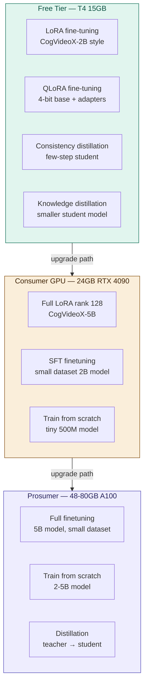

**Key insight:** On free Colab, you are NOT training a T2V model from scratch. You are **fine-tuning** an existing model to learn new styles, subjects, or motions. That is still enormously powerful — it is how every production video LoRA is made.

---

## 2. The Memory Problem — Broken Down

Training a model requires far more memory than inference. Here is why:

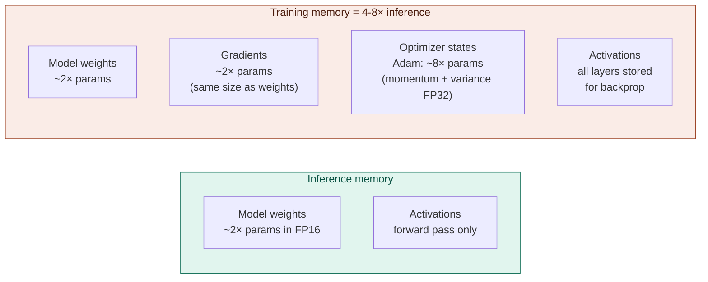

**Memory formula for full training:**

$$M_{\text{total}} = \underbrace{2N}_{\text{weights (FP16)}} + \underbrace{2N}_{\text{gradients (FP16)}} + \underbrace{8N}_{\text{Adam states (FP32)}} + \underbrace{M_{\text{act}}}_{\text{activations}}$$

where $N$ is the number of parameters in bytes. For a 5B parameter model:

$$M_{\text{weights}} = 5 \times 10^9 \times 2 = 10\text{ GB}$$
$$M_{\text{grads}} = 10\text{ GB}$$
$$M_{\text{Adam}} = 5 \times 10^9 \times 4 \times 2 = 40\text{ GB}$$
$$M_{\text{activations}} \approx 20\text{ GB (video sequence)}$$
$$M_{\text{total}} \approx 80\text{ GB}$$

That is why a 5B model OOMs even on an 80GB A100 without gradient checkpointing. Now let's fix each term.

---

## 3. LoRA — Low-Rank Adaptation

LoRA is the single most important technique for fine-tuning large models on limited hardware. Instead of updating all $N$ parameters, it learns a low-rank decomposition of the weight updates.

### 3.1 The mathematics

For a weight matrix $W_0 \in \mathbb{R}^{d \times k}$, instead of learning $\Delta W \in \mathbb{R}^{d \times k}$ (which has $d \times k$ parameters), LoRA learns:

$$\Delta W = BA$$

where $B \in \mathbb{R}^{d \times r}$ and $A \in \mathbb{R}^{r \times k}$, with $r \ll \min(d, k)$.

The modified forward pass becomes:

$$h = W_0 x + \Delta W x = W_0 x + BAx$$

$A$ is initialized with random Gaussian, $B$ is initialized to zero, so $\Delta W = 0$ at the start — training begins from the pretrained model's behavior.

**Parameter count comparison:**

$$\text{Full fine-tuning: } d \times k \text{ parameters}$$
$$\text{LoRA: } d \times r + r \times k = r(d + k) \text{ parameters}$$
$$\text{Reduction ratio: } \frac{r(d+k)}{dk} \approx \frac{r}{k} \text{ (when } d \approx k)$$

For a 3072×3072 attention weight with rank 64:

$$\frac{\text{LoRA params}}{\text{Full params}} = \frac{64 \times (3072 + 3072)}{3072^2} = \frac{393{,}216}{9{,}437{,}184} \approx 4.2\%$$

### 3.2 Scaling and merging

A scaling factor $\alpha$ controls the magnitude of the LoRA update:

$$h = W_0 x + \frac{\alpha}{r} \cdot BAx$$

Setting $\alpha = r$ (common default) gives unit scaling. Increasing $\alpha$ relative to $r$ amplifies the LoRA's effect. At inference, LoRA can be **merged** back into the base weights for zero overhead:

$$W_{\text{merged}} = W_0 + \frac{\alpha}{r} BA$$

### 3.3 Which layers to apply LoRA to

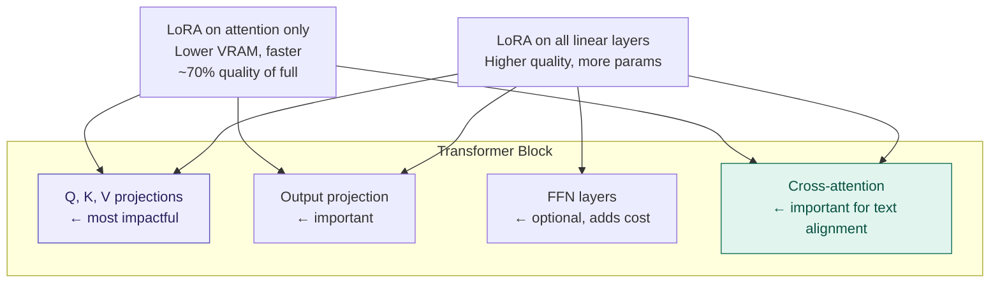

### 3.4 LoRA hyperparameters

| Parameter | What it controls | T4 recommendation | Quality recommendation |
|---|---|---|---|
| `rank r` | Model capacity | 16–32 | 64–128 |
| `alpha α` | Scaling strength | Equal to rank | Equal to rank |
| `lr` | Learning rate | 1e-4 | 1e-4 to 2e-4 |
| `steps` | Training steps | 200 × num_videos | 500 × num_videos |
| `target_modules` | Which layers | `to_q,to_k,to_v,to_out.0` | All attention + FFN |

### 3.5 Why LoRA saves memory

The optimizer states are now only over $B$ and $A$, not $W_0$:

$$M_{\text{Adam (LoRA)}} = \underbrace{8 \times r(d+k)}_{\text{LoRA states}} \ll \underbrace{8 \times dk}_{\text{Full states}}$$

For rank 64 on the 3072×3072 matrix:

$$M_{\text{Adam (LoRA)}} = 8 \times 393{,}216 \times 4 = 12.6\text{ MB}$$
$$M_{\text{Adam (Full)}} = 8 \times 9{,}437{,}184 \times 4 = 301\text{ MB}$$

**~24× reduction in optimizer states for that layer.**

---

## 4. QLoRA — Quantized LoRA

QLoRA combines 4-bit weight quantization with LoRA adapters. The base model lives in 4-bit NF4 format (frozen); only the LoRA adapters train in bfloat16.

### 4.1 NF4 quantization — the math

NF4 (Normal Float 4) is specifically designed for neural network weights, which follow an approximately normal distribution. The quantization levels are not uniformly spaced — they are placed at the quantiles of a standard normal distribution:

$$q_i = Q_F\left(\frac{i + 0.5}{2^k}\right), \quad i = 0, 1, \ldots, 2^k - 1$$

where $Q_F$ is the quantile function of the normal distribution and $k=4$ (so 16 levels).

This means the quantization error $\mathbb{E}[|w - \hat{w}|^2]$ is minimized for normally distributed weights, compared to uniform quantization.

### 4.2 Double quantization

QLoRA applies a second layer of quantization to the quantization constants themselves:

- Each 64-element block of weights gets its own scale factor $c_1 \in \mathbb{R}$ stored in FP32
- These scale factors are themselves quantized to 8-bit with a single scale factor $c_2$ per 256 blocks

This reduces the per-parameter overhead from $\frac{32}{64} = 0.5$ bits to $\frac{8}{64} + \frac{32}{256 \times 64} = 0.127$ bits.

**Total memory per parameter with QLoRA:**

$$\text{4-bit weight} + \text{quantization overhead} \approx 4.127 \text{ bits/param}$$

vs. 16 bits for FP16 — **~3.9× reduction**.

### 4.3 QLoRA memory comparison

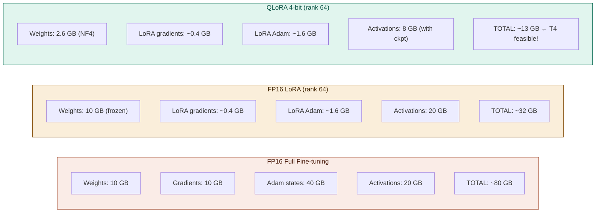

### 4.4 QLoRA implementation for video models

```python
from transformers import BitsAndBytesConfig
from peft import LoraConfig, get_peft_model
import torch

# 4-bit NF4 config
bnb_config = BitsAndBytesConfig(
    load_in_4bit=True,
    bnb_4bit_quant_type="nf4",           # Normal Float 4
    bnb_4bit_compute_dtype=torch.bfloat16, # Compute in bfloat16
    bnb_4bit_use_double_quant=True,       # Double quantization
)

# Load transformer in 4-bit
from diffusers import CogVideoXTransformer3DModel

transformer = CogVideoXTransformer3DModel.from_pretrained(
    "THUDM/CogVideoX-2b",
    subfolder="transformer",
    quantization_config=bnb_config,
    torch_dtype=torch.bfloat16,
)

# Attach LoRA adapters
lora_config = LoraConfig(
    r=16,                           # Rank (lower = less VRAM)
    lora_alpha=16,                  # Scale = alpha/r = 1.0
    target_modules=["to_q", "to_k", "to_v", "to_out.0"],
    lora_dropout=0.0,
    bias="none",
)

transformer = get_peft_model(transformer, lora_config)
transformer.print_trainable_parameters()
# "trainable params: 3,276,800 || all params: 2,000,000,000 || trainable%: 0.16%"
```

---

## 5. Gradient Checkpointing

Activations from the forward pass must be stored for use in the backward pass. For a video model with 49 frames and 42 transformer layers, this is enormous.

### 5.1 The problem

For a standard transformer block, the activations stored per layer are:

$$M_{\text{act, layer}} = B \times N \times d \times P_{\text{bytes}}$$

where $B$ = batch size, $N$ = sequence length (video tokens), $d$ = model dimension, and $P$ = bytes per value.

For CogVideoX-5B with $B=1$, $N=17{,}550$, $d=3072$, FP16:

$$M_{\text{act, layer}} = 1 \times 17{,}550 \times 3072 \times 2 = 107.9\text{ MB}$$
$$M_{\text{act, total}} = 107.9\text{ MB} \times 42 = 4.5\text{ GB}$$

This is per-layer for just the hidden states. Including attention matrices and intermediate FFN values, total activation memory is 15–20 GB.

### 5.2 The solution: recomputation

Gradient checkpointing saves only a subset of activations — typically one per transformer block boundary — and recomputes the rest on the backward pass.

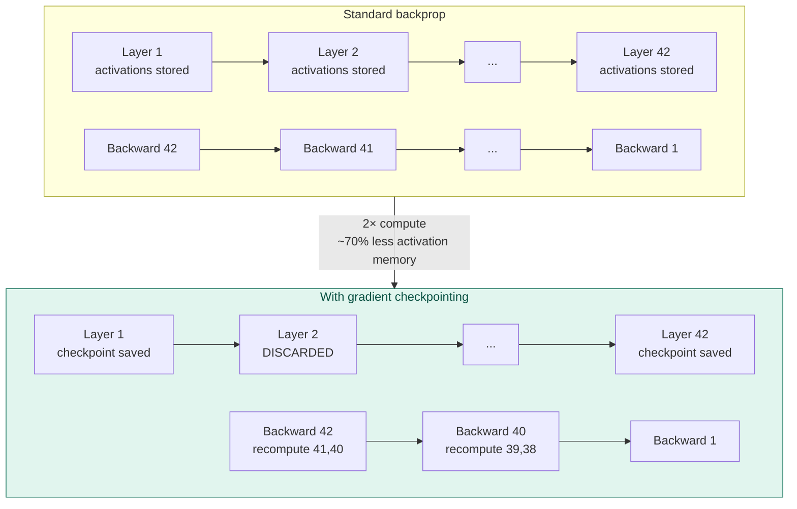

**Memory-compute tradeoff:**

$$M_{\text{checkpointed}} = O(\sqrt{L}) \times M_{\text{layer}}$$

Selecting $\sqrt{L}$ checkpoint points minimizes $M \times C$ where $C$ is the extra compute. For $L=42$ layers:

$$\text{Checkpoints} = \lceil\sqrt{42}\rceil = 7, \quad \text{Extra compute} \approx 33\%$$

In practice, gradient checkpointing reduces activation memory by ~60–70% at the cost of ~33% longer training time.

```python
# Enable gradient checkpointing
transformer.enable_gradient_checkpointing()

# Or for full pipeline
pipe.transformer.enable_gradient_checkpointing()
```

---

## 6. Mixed Precision Training

### 6.1 Precision formats

| Format | Bits | Range | Precision | Use case |
|---|---|---|---|---|
| FP32 | 32 | ±3.4×10³⁸ | ~7 decimal digits | Optimizer states |
| BF16 | 16 | ±3.4×10³⁸ | ~2 decimal digits | Weights, activations |
| FP16 | 16 | ±65,504 | ~3 decimal digits | Weights on Turing GPUs |
| INT8 | 8 | −128 to 127 | Integer | Inference / frozen weights |
| NF4 | 4 | Nonuniform | ~1 decimal digit | Frozen weights (QLoRA) |

### 6.2 Mixed precision training flow

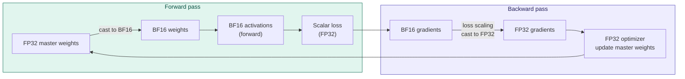

**Why keep FP32 master weights?** BF16 has limited precision (~2 decimal digits). Small gradient updates (magnitude ~1e-5) would be lost due to quantization error. The FP32 master copy accumulates these tiny updates faithfully.

**Loss scaling** prevents FP16 gradient underflow. Multiply loss by $2^{16}$ before backward, then divide gradients by $2^{16}$ before optimizer step. BF16 doesn't need this (wider dynamic range matching FP32).

```python
from accelerate import Accelerator

accelerator = Accelerator(mixed_precision="bf16")  # or "fp16" for T4

# Training loop
with accelerator.autocast():
    noise_pred = transformer(latents, timestep, encoder_hidden_states)
    loss = F.mse_loss(noise_pred, target_noise)

accelerator.backward(loss)
optimizer.step()
```

### 6.3 FP8 training (advanced, H100 only)

FP8 has two variants:
- **E4M3**: 4 exponent bits, 3 mantissa bits → range ±448, used for weights/activations
- **E5M2**: 5 exponent bits, 2 mantissa bits → range ±57,344, used for gradients

Memory savings vs BF16: ~50%. Only available on NVIDIA Hopper (H100) and Blackwell (H200) GPUs.

---

## 7. Latent Pre-computation

This is the single biggest practical speedup for video LoRA training and the key to making it work on free Colab.

### 7.1 The insight

The VAE encoder and text encoder are **frozen** during training. Running them on every batch wastes compute and memory. Instead, run them once before training and cache the results.

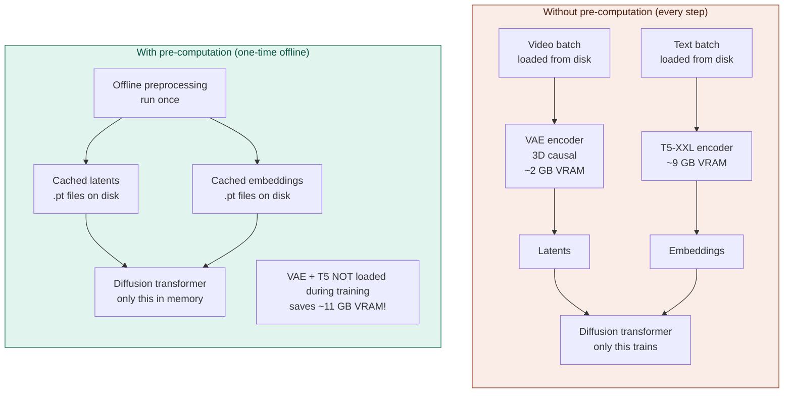

**VRAM saved:** On CogVideoX-2B training, pre-computation eliminates the need to load the T5-XXL text encoder (~9GB) and VAE encoder (~2GB) during training. This alone saves ~11GB — the difference between OOM and success on a T4.

### 7.2 Pre-computation script

```python
import torch
from diffusers import AutoencoderKLCogVideoX, CogVideoXPipeline
from transformers import T5EncoderModel
import os, json

# Load encoders once
vae = AutoencoderKLCogVideoX.from_pretrained(
    "THUDM/CogVideoX-2b", subfolder="vae",
    torch_dtype=torch.float16
).to("cuda")

text_encoder = T5EncoderModel.from_pretrained(
    "THUDM/CogVideoX-2b", subfolder="text_encoder",
    torch_dtype=torch.float16
).to("cuda")

vae.eval()
text_encoder.eval()

cache_dir = "./cached_latents"
os.makedirs(cache_dir, exist_ok=True)

# Process each video-caption pair
with open("dataset.json") as f:
    dataset = json.load(f)

with torch.no_grad():
    for item in dataset:
        video_path = item["video"]
        caption = item["caption"]
        basename = os.path.splitext(os.path.basename(video_path))[0]

        # Encode video → latents
        video_tensor = load_video(video_path)  # (T, C, H, W)
        video_tensor = video_tensor.unsqueeze(0).to("cuda", torch.float16)
        latents = vae.encode(video_tensor).latent_dist.sample()
        latents = latents * vae.config.scaling_factor

        # Encode text → embeddings
        input_ids = tokenizer(caption, return_tensors="pt").input_ids.to("cuda")
        embeddings = text_encoder(input_ids).last_hidden_state

        # Cache to disk
        torch.save({
            "latents": latents.cpu(),
            "embeddings": embeddings.cpu(),
            "caption": caption,
        }, f"{cache_dir}/{basename}.pt")

print("Pre-computation complete. VAE and T5 can now be unloaded.")
del vae, text_encoder
torch.cuda.empty_cache()
```

---

## 8. Knowledge Distillation

Knowledge distillation transfers capabilities from a large **teacher** model to a smaller **student** model. The student learns to mimic the teacher's output distribution, not just match ground truth labels.

### 8.1 The core idea

Standard training: student learns from ground truth videos
$$\mathcal{L}_{\text{standard}} = \mathbb{E}\left[\|y_{\text{true}} - f_S(x)\|^2\right]$$

Knowledge distillation: student also learns from teacher's predictions
$$\mathcal{L}_{\text{KD}} = (1-\lambda)\mathcal{L}_{\text{task}} + \lambda \mathcal{L}_{\text{distill}}$$

$$\mathcal{L}_{\text{distill}} = \mathbb{E}\left[\|\boldsymbol{\varepsilon}_T(\mathbf{z}_t, t, \mathbf{c}) - \boldsymbol{\varepsilon}_S(\mathbf{z}_t, t, \mathbf{c})\|^2\right]$$

where $\boldsymbol{\varepsilon}_T$ is the teacher's noise prediction and $\boldsymbol{\varepsilon}_S$ is the student's.

### 8.2 Distillation strategies for video models

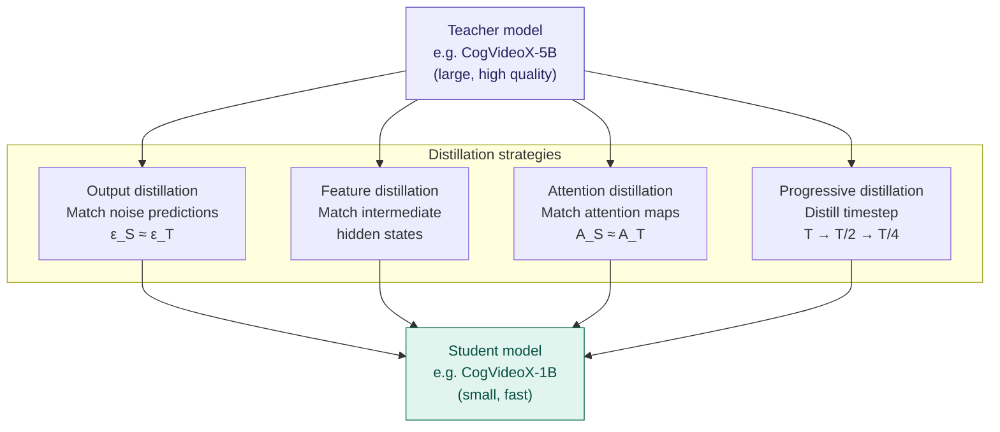

### 8.3 Feature-level distillation

Matching intermediate hidden states carries richer information than just output matching:

$$\mathcal{L}_{\text{feat}} = \sum_{l \in \mathcal{L}} \left\| \phi_l\left(\mathbf{h}_l^T\right) - \mathbf{h}_l^S \right\|^2$$

where $\mathbf{h}_l^T, \mathbf{h}_l^S$ are teacher/student hidden states at layer $l$, and $\phi_l$ is a learned projection (since teacher and student may have different dimensions).

### 8.4 Practical distillation on limited hardware

The problem: you need to run the **teacher** forward pass during training, which requires the large model to be in memory alongside the student.

**Solution:** Run teacher forward passes offline and cache the noise predictions:

```python
# STEP 1: Offline — cache teacher predictions (run on better hardware / Colab Pro)
teacher = CogVideoXPipeline.from_pretrained("THUDM/CogVideoX-5b", torch_dtype=torch.float16)
teacher.enable_model_cpu_offload()

teacher_cache = {}
for sample in training_dataset:
    t = random_timestep()
    z_t = add_noise(sample["latents"], t)
    with torch.no_grad():
        teacher_eps = teacher.transformer(z_t, t, sample["embeddings"])
    teacher_cache[sample["id"]] = {"t": t, "z_t": z_t, "eps": teacher_eps.cpu()}

# STEP 2: Train student using cached teacher outputs (runs on T4)
student = CogVideoXTransformer3DModel.from_pretrained(
    "THUDM/CogVideoX-2b", subfolder="transformer"  # smaller student
)

for batch in training_dataloader:
    student_eps = student(batch["z_t"], batch["t"], batch["embeddings"])
    teacher_eps = teacher_cache[batch["id"]]["eps"].to("cuda")

    # Distillation loss: student matches teacher
    loss_distill = F.mse_loss(student_eps, teacher_eps)

    # Task loss: student also matches actual noise
    loss_task = F.mse_loss(student_eps, batch["actual_noise"])

    loss = 0.5 * loss_distill + 0.5 * loss_task
    loss.backward()
    optimizer.step()
```

---

## 9. Consistency Distillation

Consistency distillation is a specific form of distillation that trains a model to jump from any point on the denoising trajectory directly to the clean video in one step.

### 9.1 The consistency condition

A consistency model $f_\theta$ satisfies:

$$f_\theta(\mathbf{z}_t, t) = f_\theta(\mathbf{z}_s, s) \quad \forall s, t \text{ on the same trajectory from } \mathbf{z}_0$$

Both points on the same ODE path should map to the same clean video.

### 9.2 Consistency distillation loss

Given a teacher ODE solver $\Phi$ (e.g. DDIM), the student is trained so that adjacent trajectory points produce the same output:

$$\mathcal{L}_{\text{CD}} = \mathbb{E}_{t, \mathbf{z}_0}\left[d\left(f_\theta(\mathbf{z}_{t+\Delta}, t+\Delta),\; f_{\theta^-}\left(\hat{\mathbf{z}}_t^{\Phi}, t\right)\right)\right]$$

where:
- $\hat{\mathbf{z}}_t^{\Phi}$ is the one-step DDIM estimate from $\mathbf{z}_{t+\Delta}$
- $\theta^-$ is an exponential moving average (EMA) of $\theta$ — the "target network"
- $d$ is a distance metric (e.g., $\ell_2$ or LPIPS)

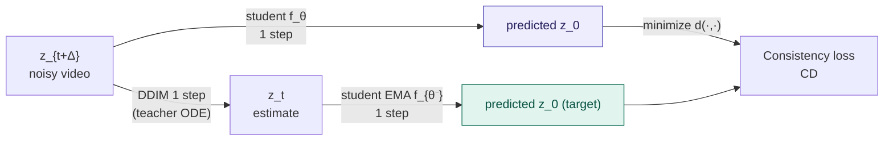

### 9.3 Why this matters for limited hardware

After consistency distillation, the student generates videos in **4–8 steps** instead of 50. This means:
- 6–12× faster inference
- You can generate a training validation video in 30 seconds instead of 15 minutes
- The distilled model fits in less memory (same architecture, just different weights)

**LTX-Video Distilled** uses exactly this approach — the distilled model runs in 4–8 steps and is available at `Lightricks/LTX-Video-0.9.7-distilled`.

### 9.4 Progressive distillation

An alternative: compress a 50-step model into a 25-step model, then into a 12-step model, then into a 6-step model — each step is easier than jumping directly to 1-step generation.

$$\text{Teacher: 50 steps} \xrightarrow{\text{distill}} \text{Student: 25 steps} \xrightarrow{\text{distill}} \text{Student: 12 steps} \xrightarrow{\text{distill}} \text{Student: 6 steps}$$

Each distillation round has the same training cost. This is how Stable Diffusion's LCM (Latent Consistency Model) works.

---

## 10. Progressive Training (Curriculum Learning)

Start with small, cheap problems and gradually increase difficulty. This is not just practical — it leads to better final quality.


**Why this works:**
1. Stage 1 trains the model to understand the concept at low resolution quickly (cheap)
2. Stage 2 refines spatial quality
3. Stage 3 adds temporal quality at full resolution

**Token count scales quadratically with resolution:**

$$N_{\text{tokens}} = \frac{H}{p} \times \frac{W}{p} \times \frac{T-1}{4}+1$$

Going from 256×144 to 512×288 quadruples the token count and therefore quadruples attention compute.

---

## 11. Gradient Accumulation

Effective batch size matters for stable training. But large batches don't fit in memory.

**Solution:** accumulate gradients over $k$ mini-batches before stepping:

$$\nabla_{\text{eff}} = \frac{1}{k} \sum_{i=1}^{k} \nabla_{\mathbf{\theta}} \mathcal{L}(\mathbf{x}_i, \mathbf{y}_i)$$

This is mathematically equivalent to a batch of size $k \times B_{\text{mini}}$.

```python
optimizer.zero_grad()
accumulation_steps = 4  # effective batch size = 4 × 1 = 4

for step, batch in enumerate(dataloader):
    with accelerator.autocast():
        loss = compute_loss(batch)
        loss = loss / accumulation_steps  # normalize

    accelerator.backward(loss)

    if (step + 1) % accumulation_steps == 0:
        optimizer.step()
        scheduler.step()
        optimizer.zero_grad()
```

**Learning rate scaling:** when increasing effective batch size by $k$, scale learning rate by $\sqrt{k}$ (square root rule) or $k$ (linear rule):

$$\text{lr}_{\text{eff}} = \text{lr}_{\text{base}} \times \sqrt{k} \quad \text{(square root scaling)}$$

---

## 12. CPU Offloading

Move optimizer states to CPU RAM when not needed. RAM is cheap (12–51GB on Colab) while GPU VRAM is scarce (15GB free T4).

### 12.1 Adam optimizer on CPU

```python
from bitsandbytes.optim import AdamW8bit
# or use CPUAdam from DeepSpeed
from deepspeed.ops.adam import DeepSpeedCPUAdam

# 8-bit Adam: reduces optimizer states from 8× to 2× params
optimizer = AdamW8bit(
    trainable_params,
    lr=1e-4,
    weight_decay=0.01,
)

# CPU Adam: optimizer states live on CPU, updates happen on CPU
optimizer = DeepSpeedCPUAdam(
    trainable_params,
    lr=1e-4,
    adamw_mode=True,
)
```

### 12.2 Memory breakdown with 8-bit Adam

8-bit Adam quantizes optimizer momentum and variance to 8-bit integers:

$$M_{\text{Adam8}} = \underbrace{2N}_{\text{mom1 in INT8}} + \underbrace{2N}_{\text{mom2 in INT8}} = 4N \text{ bytes (was 8N)}$$

Combined with LoRA (only optimizing $r(d+k)$ parameters):

$$M_{\text{Adam8+LoRA}} = 4 \times r(d+k) \text{ bytes total} \approx 1.5\text{ GB for rank-64 full model}$$

---

## 13. The Complete Stack

Combining everything for maximum effect on a T4 GPU:

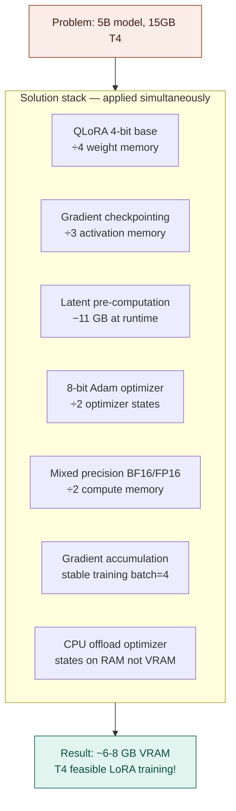

**Cumulative VRAM reduction:**

| Technique | VRAM before | VRAM after | Reduction |
|---|---|---|---|
| Baseline 5B model inference | 80 GB | 80 GB | — |
| QLoRA 4-bit | 80 GB | 35 GB | 56% |
| + Gradient checkpointing | 35 GB | 18 GB | 49% |
| + Pre-computed latents | 18 GB | 7 GB | 61% |
| + 8-bit Adam | 7 GB | 5.5 GB | 21% |
| + CPU offload | 5.5 GB | 4.5 GB | 18% |

**Final result: 4.5 GB active VRAM for training a 5B parameter video model.**

---

## 14. End-to-End: Training a Custom Video Style LoRA on Colab

This is the complete, practical workflow.

### 14.1 Dataset preparation

You need **10–50 short video clips** with captions. Quality > quantity.

```
dataset/
├── videos/
│   ├── clip_001.mp4   (3-10 seconds each)
│   ├── clip_002.mp4
│   └── ...
└── captions/
    ├── clip_001.txt   ("A [TRIGGER] style video of...")
    ├── clip_002.txt
    └── ...
```

**Caption format:** Always include a trigger word (e.g., `MYSTYLE`) in every caption. This trains the LoRA to activate only when that token is present.

**Video requirements:**
- Duration: 3–10 seconds (49 frames at 8fps is 6 seconds)
- Resolution: 512×288 minimum for training, downscale if needed
- Content: consistent style, subject, or motion pattern you want to learn

### 14.2 Full Colab training notebook

```python
# ============================================================
# CELL 1 — Install dependencies
# ============================================================
!pip install -q \
    "diffusers>=0.30.3" \
    "transformers>=4.44.2" \
    "accelerate>=0.33.0" \
    "peft>=0.12.0" \
    "bitsandbytes>=0.43.0" \
    "imageio[ffmpeg]" \
    "sentencepiece" \
    "huggingface_hub"

!git clone --depth=1 https://github.com/huggingface/finetrainers
```

```python
# ============================================================
# CELL 2 — Mount Drive and set up paths
# ============================================================
from google.colab import drive
drive.mount("/content/drive")

import os

DRIVE_ROOT = "/content/drive/MyDrive/video_lora"
os.makedirs(f"{DRIVE_ROOT}/dataset/videos", exist_ok=True)
os.makedirs(f"{DRIVE_ROOT}/dataset/captions", exist_ok=True)
os.makedirs(f"{DRIVE_ROOT}/cached_latents", exist_ok=True)
os.makedirs(f"{DRIVE_ROOT}/checkpoints", exist_ok=True)

print("Upload your videos to:", f"{DRIVE_ROOT}/dataset/videos/")
print("Upload captions to:", f"{DRIVE_ROOT}/dataset/captions/")
```

```python
# ============================================================
# CELL 3 — Pre-compute latents and embeddings (ONE TIME)
# This is the key to fitting on T4
# ============================================================
import torch, os, glob
from diffusers import AutoencoderKLCogVideoX
from transformers import T5EncoderModel, T5Tokenizer
import imageio, numpy as np

MODEL_ID = "THUDM/CogVideoX-2b"
CACHE_DIR = f"{DRIVE_ROOT}/cached_latents"

print("Loading VAE and text encoder for pre-computation...")

vae = AutoencoderKLCogVideoX.from_pretrained(
    MODEL_ID, subfolder="vae",
    torch_dtype=torch.float16,
).to("cuda").eval()

tokenizer = T5Tokenizer.from_pretrained(MODEL_ID, subfolder="tokenizer")
text_encoder = T5EncoderModel.from_pretrained(
    MODEL_ID, subfolder="text_encoder",
    torch_dtype=torch.float16,
).to("cuda").eval()

def load_video(path, target_frames=49, height=288, width=512):
    """Load video as tensor (1, C, T, H, W) in [-1, 1]"""
    reader = imageio.get_reader(path)
    frames = []
    fps_ratio = max(1, reader.get_meta_data()["fps"] / 8)
    for i, frame in enumerate(reader):
        if i % fps_ratio < 1:
            frame = np.array(frame)
            frame = torch.from_numpy(frame).permute(2, 0, 1).float() / 127.5 - 1
            frames.append(frame)
        if len(frames) >= target_frames:
            break
    # Pad or trim to target_frames
    while len(frames) < target_frames:
        frames.append(frames[-1])
    frames = torch.stack(frames[:target_frames])  # (T, C, H, W)
    return frames.unsqueeze(0).to("cuda", torch.float16)  # (1, T, C, H, W)

video_files = sorted(glob.glob(f"{DRIVE_ROOT}/dataset/videos/*.mp4"))
print(f"Found {len(video_files)} videos")

with torch.no_grad():
    for video_path in video_files:
        name = os.path.splitext(os.path.basename(video_path))[0]
        cache_path = f"{CACHE_DIR}/{name}.pt"

        if os.path.exists(cache_path):
            print(f"  Skipping {name} (already cached)")
            continue

        caption_path = f"{DRIVE_ROOT}/dataset/captions/{name}.txt"
        with open(caption_path) as f:
            caption = f.read().strip()

        # Encode video
        video = load_video(video_path)
        # Rearrange to (B, C, T, H, W)
        video = video.permute(0, 2, 1, 3, 4)
        latents = vae.encode(video).latent_dist.sample()
        latents = latents * vae.config.scaling_factor

        # Encode text
        input_ids = tokenizer(
            caption, return_tensors="pt",
            padding="max_length", max_length=226, truncation=True
        ).input_ids.to("cuda")
        embeddings = text_encoder(input_ids).last_hidden_state

        torch.save({
            "latents": latents.cpu().half(),
            "embeddings": embeddings.cpu().half(),
            "caption": caption,
        }, cache_path)
        print(f"  Cached {name}: latents {latents.shape}, embeddings {embeddings.shape}")

print("Pre-computation complete!")
del vae, text_encoder
torch.cuda.empty_cache()
import gc; gc.collect()
```

```python
# ============================================================
# CELL 4 — Load transformer with QLoRA
# ============================================================
import torch
from diffusers import CogVideoXTransformer3DModel
from peft import LoraConfig, get_peft_model
from transformers import BitsAndBytesConfig

MODEL_ID = "THUDM/CogVideoX-2b"

# 4-bit quantization config (QLoRA)
bnb_config = BitsAndBytesConfig(
    load_in_4bit=True,
    bnb_4bit_quant_type="nf4",
    bnb_4bit_compute_dtype=torch.bfloat16,
    bnb_4bit_use_double_quant=True,
)

print("Loading transformer in 4-bit (QLoRA)...")
transformer = CogVideoXTransformer3DModel.from_pretrained(
    MODEL_ID, subfolder="transformer",
    quantization_config=bnb_config,
    torch_dtype=torch.bfloat16,
)

# Enable gradient checkpointing before adding LoRA
transformer.enable_gradient_checkpointing()

# LoRA configuration
lora_config = LoraConfig(
    r=16,                    # Rank — increase for better quality (try 32, 64)
    lora_alpha=16,           # Keep equal to rank for unit scaling
    target_modules=[
        "to_q", "to_k", "to_v", "to_out.0",    # Self-attention
        "add_q_proj", "add_k_proj", "add_v_proj", "to_add_out",  # Cross-attention
    ],
    lora_dropout=0.0,
    bias="none",
)

transformer = get_peft_model(transformer, lora_config)
transformer.print_trainable_parameters()

print(f"\nGPU memory: {torch.cuda.memory_allocated()/1e9:.2f} GB")
```

```python
# ============================================================
# CELL 5 — Dataset and training loop
# ============================================================
import torch
import torch.nn.functional as F
from torch.utils.data import Dataset, DataLoader
from bitsandbytes.optim import AdamW8bit
import os, glob, random

CACHE_DIR = f"{DRIVE_ROOT}/cached_latents"
CHECKPOINT_DIR = f"{DRIVE_ROOT}/checkpoints"

class CachedVideoDataset(Dataset):
    def __init__(self, cache_dir):
        self.files = sorted(glob.glob(f"{cache_dir}/*.pt"))
        print(f"Dataset: {len(self.files)} cached samples")

    def __len__(self):
        return len(self.files)

    def __getitem__(self, idx):
        data = torch.load(self.files[idx])
        return data["latents"].squeeze(0), data["embeddings"].squeeze(0)

dataset = CachedVideoDataset(CACHE_DIR)
dataloader = DataLoader(dataset, batch_size=1, shuffle=True)

# 8-bit Adam — reduces optimizer memory by ~4×
optimizer = AdamW8bit(
    transformer.parameters(),
    lr=1e-4,
    weight_decay=1e-2,
)

NUM_TRAIN_STEPS = len(dataset) * 200  # 200 steps per video
GRADIENT_ACCUMULATION = 4
SAVE_EVERY = 500

print(f"Training for {NUM_TRAIN_STEPS} steps")
print(f"Effective batch size: {GRADIENT_ACCUMULATION}")

transformer.train()
global_step = 0
optimizer.zero_grad()

for epoch in range(NUM_TRAIN_STEPS // len(dataset) + 1):
    for latents, embeddings in dataloader:
        latents = latents.to("cuda", torch.bfloat16)
        embeddings = embeddings.to("cuda", torch.bfloat16)

        # Sample random timestep
        bsz = latents.shape[0]
        t = torch.randint(0, 1000, (bsz,), device="cuda")

        # Add noise (forward diffusion)
        noise = torch.randn_like(latents)
        alpha_bar = torch.cos(t.float() / 1000 * torch.pi / 2) ** 2
        alpha_bar = alpha_bar.view(-1, 1, 1, 1, 1)
        noisy_latents = alpha_bar.sqrt() * latents + (1 - alpha_bar).sqrt() * noise

        # Forward pass — predict noise
        with torch.autocast("cuda", dtype=torch.bfloat16):
            noise_pred = transformer(
                hidden_states=noisy_latents,
                timestep=t,
                encoder_hidden_states=embeddings,
            ).sample

        # Loss: predict the noise we added
        loss = F.mse_loss(noise_pred.float(), noise.float())
        loss = loss / GRADIENT_ACCUMULATION

        loss.backward()

        if (global_step + 1) % GRADIENT_ACCUMULATION == 0:
            torch.nn.utils.clip_grad_norm_(transformer.parameters(), 1.0)
            optimizer.step()
            optimizer.zero_grad()

        global_step += 1

        if global_step % 100 == 0:
            vram = torch.cuda.memory_allocated() / 1e9
            print(f"Step {global_step}/{NUM_TRAIN_STEPS} | Loss: {loss.item()*GRADIENT_ACCUMULATION:.4f} | VRAM: {vram:.1f}GB")

        if global_step % SAVE_EVERY == 0:
            transformer.save_pretrained(f"{CHECKPOINT_DIR}/step_{global_step}")
            print(f"  Saved checkpoint at step {global_step}")

        if global_step >= NUM_TRAIN_STEPS:
            break

# Save final LoRA weights
transformer.save_pretrained(f"{CHECKPOINT_DIR}/final")
print("Training complete! LoRA saved to:", f"{CHECKPOINT_DIR}/final")
```

```python
# ============================================================
# CELL 6 — Inference with trained LoRA
# ============================================================
import torch
from diffusers import CogVideoXPipeline
from peft import PeftModel
from diffusers.utils import export_to_video
import numpy as np, imageio

MODEL_ID = "THUDM/CogVideoX-2b"
LORA_PATH = f"{DRIVE_ROOT}/checkpoints/final"

# Load base pipeline
pipe = CogVideoXPipeline.from_pretrained(MODEL_ID, torch_dtype=torch.float16)
pipe.enable_model_cpu_offload()
pipe.vae.enable_slicing()
pipe.vae.enable_tiling()

# Load trained LoRA
pipe.transformer = PeftModel.from_pretrained(pipe.transformer, LORA_PATH)
pipe.transformer = pipe.transformer.merge_and_unload()  # merge for inference speed
print("LoRA loaded and merged!")

PROMPT = "A MYSTYLE video of a golden eagle soaring over mountains"

with torch.inference_mode():
    frames = pipe(
        prompt=PROMPT,
        num_frames=49,
        num_inference_steps=50,
        guidance_scale=6.0,
        generator=torch.Generator("cuda").manual_seed(42),
    ).frames[0]

# Safe save
frames_np = []
for frame in frames:
    arr = np.array(frame, dtype=np.float32)
    if arr.max() <= 1.0:
        arr = arr * 255.0
    arr = np.nan_to_num(arr, nan=0.0, posinf=255.0, neginf=0.0)
    frames_np.append(np.clip(arr, 0, 255).astype(np.uint8))

imageio.mimsave(f"{DRIVE_ROOT}/result.mp4", frames_np, fps=8)
print("Video saved!")
```

---

## 15. VRAM Budget Table

How different technique combinations affect training VRAM for CogVideoX-2B (2B params):

| Configuration | Weights | Grads | Optimizer | Activations | **Total** | T4 feasible? |
|---|---|---|---|---|---|---|
| Full FP16, full Adam | 4 GB | 4 GB | 16 GB | 20 GB | **~44 GB** | ❌ |
| FP16 LoRA r=64 | 4 GB | 0.4 GB | 1.6 GB | 20 GB | **~26 GB** | ❌ |
| FP16 LoRA r=64 + grad ckpt | 4 GB | 0.4 GB | 1.6 GB | 7 GB | **~13 GB** | ⚠️ |
| FP16 LoRA r=16 + grad ckpt + precompute | 4 GB | 0.1 GB | 0.4 GB | 3 GB | **~7.5 GB** | ✅ |
| QLoRA 4-bit + LoRA r=16 + grad ckpt + precompute | 1 GB | 0.1 GB | 0.4 GB | 3 GB | **~4.5 GB** | ✅✅ |
| QLoRA 4-bit + LoRA r=64 + grad ckpt + precompute | 1 GB | 0.4 GB | 1.6 GB | 3 GB | **~6 GB** | ✅ |

---

## 16. Roadmap: From LoRA to Full Model

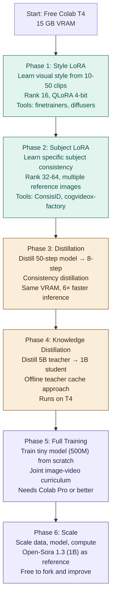

### Key tools at each phase

| Phase | Tool | GitHub |
|---|---|---|
| LoRA training | finetrainers | `huggingface/finetrainers` |
| LoRA training | cogvideox-factory | `a-r-r-o-w/cogvideox-factory` |
| LTX-Video LoRA | AI Toolkit | `ostris/ai-toolkit` |
| Distillation | T2V-Turbo | `Ji4chenLi/t2v-turbo` |
| Full training | Open-Sora | `hpcaitech/Open-Sora` |
| Quantization | bitsandbytes | `TimDettmers/bitsandbytes` |
| PEFT | HuggingFace PEFT | `huggingface/peft` |
| Training framework | Accelerate | `huggingface/accelerate` |

---

## Summary: The Techniques at a Glance

| Technique | What it reduces | How much | Downside |
|---|---|---|---|
| LoRA | Optimizer states + gradients | ~10–100× fewer trainable params | Lower quality than full FT |
| QLoRA | Weight memory (base model) | 4× vs FP16 | Slightly noisier gradients |
| Gradient checkpointing | Activation memory | ~3× | ~33% slower training |
| Mixed precision (BF16) | Compute + memory | ~2× vs FP32 | Requires careful loss scaling |
| Latent pre-computation | Runtime VRAM | −11 GB on CogVideoX | One-time offline cost |
| 8-bit Adam | Optimizer VRAM | ~4× | Slight numerical noise |
| Gradient accumulation | VRAM per step | Proportional to accum steps | None (free lunch) |
| CPU offload | VRAM for optimizer | Moves to RAM | Slower step time |
| Knowledge distillation | Student model size | Custom (2–10×) | Needs teacher compute |
| Consistency distillation | Inference steps | 6–12× fewer steps | Training complexity |
| Progressive training | Early training cost | Up to 16× first stages | Requires staged setup |

**The core equation:** every technique is attacking one term of:

$$M_{\text{total}} = \underbrace{2N}_{\text{weights}} + \underbrace{2N_{\text{LoRA}}}_{\text{grads}} + \underbrace{8N_{\text{LoRA}}}_{\text{Adam}} + \underbrace{M_{\text{act}/\text{ckpt}}}_{\text{activations}}$$

Apply all of them simultaneously and a 5B model trains on 4.5 GB of VRAM. Nothing is impossible.

---

*Resources: [finetrainers](https://github.com/huggingface/finetrainers) · [cogvideox-factory](https://github.com/a-r-r-o-w/cogvideox-factory) · [HuggingFace PEFT](https://github.com/huggingface/peft) · [bitsandbytes](https://github.com/TimDettmers/bitsandbytes) · [Open-Sora](https://github.com/hpcaitech/Open-Sora)*
