# Text-to-Video Generation: Complete Architecture Reference

> A detailed technical reference covering every component of modern T2V systems — from raw text input to rendered video frames — including mathematics, architectural variants, and implementation details.

---

## Table of Contents

1. [System Overview](#1-system-overview)
2. [Text Encoding](#2-text-encoding)
3. [Latent Space and 3D VAE](#3-latent-space-and-3d-vae)
4. [Diffusion Process](#4-diffusion-process)
5. [Denoising Backbone: U-Net vs DiT](#5-denoising-backbone-u-net-vs-dit)
6. [Attention Mechanisms](#6-attention-mechanisms)
7. [Positional Encoding (3D RoPE)](#7-positional-encoding-3d-rope)
8. [Conditioning Mechanisms](#8-conditioning-mechanisms)
9. [Noise Schedules](#9-noise-schedules)
10. [Training Pipeline](#10-training-pipeline)
11. [Inference Techniques](#11-inference-techniques)
12. [Model Comparisons](#12-model-comparisons)
13. [Minor but Critical Details](#13-minor-but-critical-details)
14. [Complexity Analysis](#14-complexity-analysis)

---

## 1. System Overview

A text-to-video model maps a natural language string to a temporally coherent sequence of image frames. The end-to-end pipeline consists of five major subsystems operating in sequence.

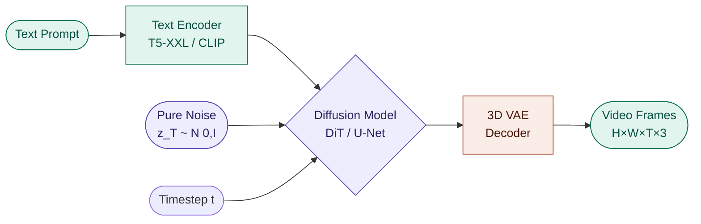

### Key dimensions

| Variable | Meaning | Typical value |
|---|---|---|
| `H, W` | Video height and width | 480 × 720 |
| `T` | Number of frames | 49 |
| `C` | Latent channels | 16 |
| `h, w` | Latent spatial dims | H/8, W/8 |
| `t_lat` | Latent temporal dim | (T-1)/4 + 1 = 13 |
| `d_model` | Transformer hidden dim | 3072 (5B) |
| `d_text` | Text embedding dim | 4096 (T5-XXL) |
| `L` | Transformer layers | 42 (5B) |
| `H_attn` | Attention heads | 48 |

---

## 2. Text Encoding

### 2.1 Architecture choices

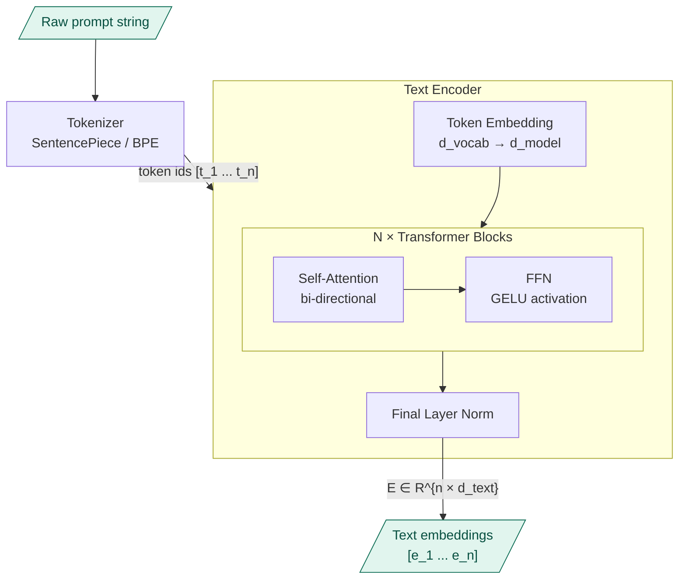

### 2.2 T5-XXL vs CLIP comparison

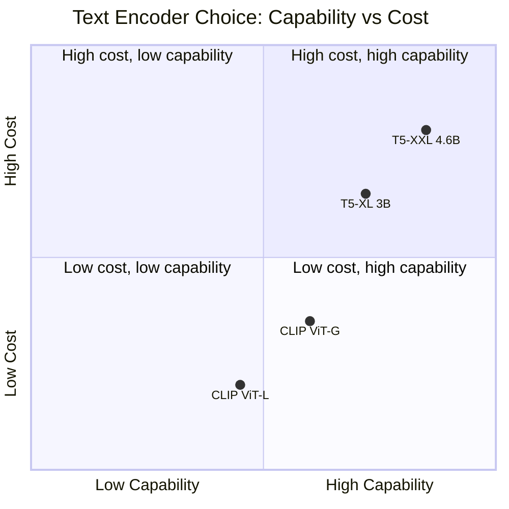

| Property | T5-XXL | CLIP ViT-L/14 |
|---|---|---|
| Parameters | 4.6B | 123M |
| Max tokens | 512 | 77 |
| Embedding dim | 4096 | 768 |
| Training objective | Span prediction | Contrastive (image-text) |
| Strength | Long, complex prompts | Short visual descriptions |
| Used by | CogVideoX, Wan, HunyuanVideo | AnimateDiff, older models |

### 2.3 Text embedding math

Given tokenized input $\mathbf{t} = [t_1, \ldots, t_n]$:

$$\mathbf{E} = \text{T5Encoder}(\mathbf{t}) \in \mathbb{R}^{n \times 4096}$$

This embedding matrix is the **key and value** source for all cross-attention layers in the diffusion model. Each video token can attend to any text token at every transformer layer.

---

## 3. Latent Space and 3D VAE

Operating in pixel space for video is computationally impossible at scale. A 720×480×49 video has:

$$720 \times 480 \times 49 \times 3 = 50{,}803{,}200 \approx 50\text{M values}$$

The 3D VAE compresses this by **~155×** into a tractable latent space.

### 3.1 Compression architecture

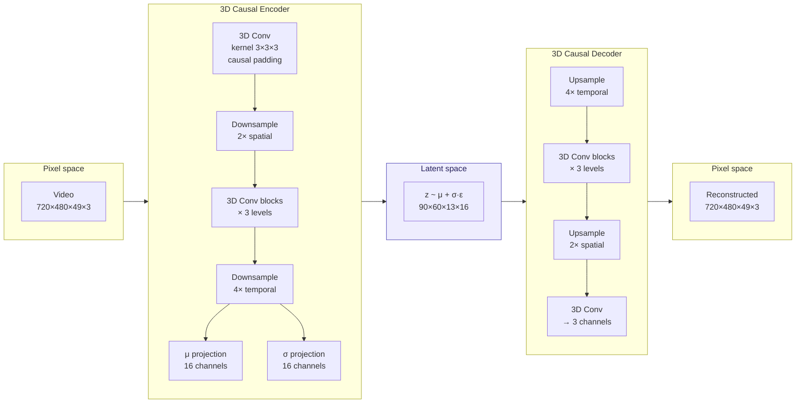

### 3.2 Causal convolution — why it matters

A standard 3D convolution at temporal position $t$ uses frames $[t-k, \ldots, t+k]$ — it peeks into the future. A **causal** convolution pads only the past:

```
Standard 3D conv (t=3, k=1):  uses frames [2, 3, 4]  ← future leak
Causal 3D conv  (t=3, k=1):  uses frames [2, 3, 3]  ← padded, no future
```

**Padding rule for causal convolution:**

$$\text{pad\_left} = (k_t - 1), \quad \text{pad\_right} = 0$$

where $k_t$ is the temporal kernel size. This ensures:

$$\mathbf{z}_t = f(\mathbf{x}_{t-k_t+1}, \ldots, \mathbf{x}_t)$$

Benefits: streaming generation, no temporal bleeding between scenes, consistent with autoregressive inference.

### 3.3 KL regularization

The VAE encoder produces a Gaussian distribution over latents. The training loss includes:

$$\mathcal{L}_{\text{VAE}} = \underbrace{\mathcal{L}_{\text{recon}}}_{\text{pixel reconstruction}} + \beta \cdot \underbrace{D_{\text{KL}}\left(\mathcal{N}(\mu, \sigma^2) \| \mathcal{N}(0, I)\right)}_{\text{regularization}}$$

$$D_{\text{KL}} = -\frac{1}{2}\sum_{i}\left(1 + \log\sigma_i^2 - \mu_i^2 - \sigma_i^2\right)$$

At inference, only the decoder is used: $\hat{\mathbf{x}} = D_\theta(\mathbf{z})$.

### 3.4 Scaling factor

After encoding, latents are scaled to unit variance:

$$\tilde{\mathbf{z}} = \mathbf{z} / s$$

where $s$ is the empirical standard deviation of training latents (typically $s \approx 0.18$ for CogVideoX). This scaling ensures the diffusion model operates in a well-conditioned space.

---

## 4. Diffusion Process

### 4.1 Forward process (training only)

Starting from clean latent $\mathbf{z}_0$, add noise progressively over $T$ timesteps:

$$q(\mathbf{z}_t | \mathbf{z}_0) = \mathcal{N}\left(\mathbf{z}_t ; \sqrt{\bar{\alpha}_t}\,\mathbf{z}_0,\; (1 - \bar{\alpha}_t)\mathbf{I}\right)$$

This can be sampled in one step:

$$\mathbf{z}_t = \sqrt{\bar{\alpha}_t}\,\mathbf{z}_0 + \sqrt{1 - \bar{\alpha}_t}\,\boldsymbol{\varepsilon}, \quad \boldsymbol{\varepsilon} \sim \mathcal{N}(\mathbf{0}, \mathbf{I})$$

where $\bar{\alpha}_t = \prod_{s=1}^{t}(1 - \beta_s)$ and $\{\beta_t\}$ is the noise schedule.

### 4.2 Reverse process (inference)

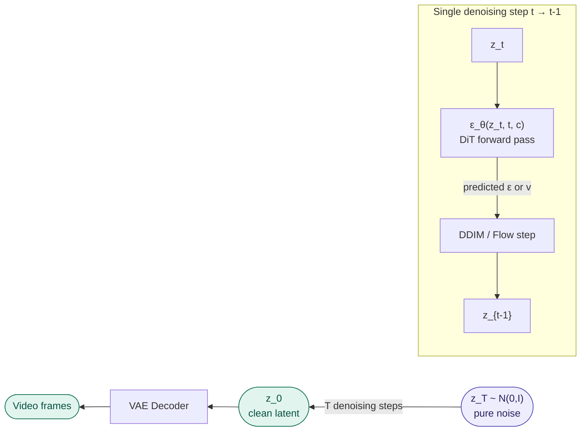

**DDIM reverse step** (deterministic):

$$\mathbf{z}_{t-1} = \sqrt{\bar{\alpha}_{t-1}} \underbrace{\left(\frac{\mathbf{z}_t - \sqrt{1-\bar{\alpha}_t}\,\hat{\boldsymbol{\varepsilon}}_\theta}{\sqrt{\bar{\alpha}_t}}\right)}_{\text{predicted } \mathbf{z}_0} + \sqrt{1-\bar{\alpha}_{t-1}}\,\hat{\boldsymbol{\varepsilon}}_\theta$$

where $\hat{\boldsymbol{\varepsilon}}_\theta = \varepsilon_\theta(\mathbf{z}_t, t, \mathbf{c})$ is the model's noise prediction.

### 4.3 Training objective

**Epsilon (noise) prediction:**

$$\mathcal{L}_{\text{simple}} = \mathbb{E}_{t, \mathbf{z}_0, \boldsymbol{\varepsilon}}\left[\left\|\boldsymbol{\varepsilon} - \boldsymbol{\varepsilon}_\theta(\mathbf{z}_t, t, \mathbf{c})\right\|^2\right]$$

**v-prediction** (more numerically stable near $t=0$):

$$\mathbf{v}_t = \sqrt{\bar{\alpha}_t}\,\boldsymbol{\varepsilon} - \sqrt{1-\bar{\alpha}_t}\,\mathbf{z}_0$$

$$\mathcal{L}_v = \mathbb{E}_{t, \mathbf{z}_0, \boldsymbol{\varepsilon}}\left[\left\|\mathbf{v}_t - \mathbf{v}_\theta(\mathbf{z}_t, t, \mathbf{c})\right\|^2\right]$$

Both objectives are equivalent — v-prediction improves stability at low noise levels where epsilon prediction becomes ill-conditioned.

---

## 5. Denoising Backbone: U-Net vs DiT

### 5.1 U-Net (legacy approach)

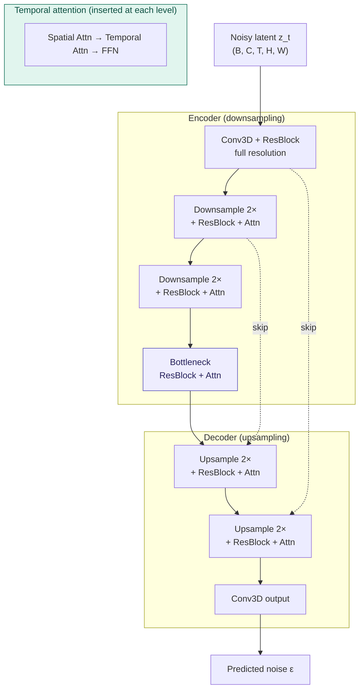

**U-Net limitations for video:**
- Skip connections carry full-resolution feature maps — memory intensive
- Temporal attention is factorized from spatial — limited cross-frame reasoning
- Scales poorly beyond ~1B parameters

### 5.2 Diffusion Transformer (DiT) — modern standard

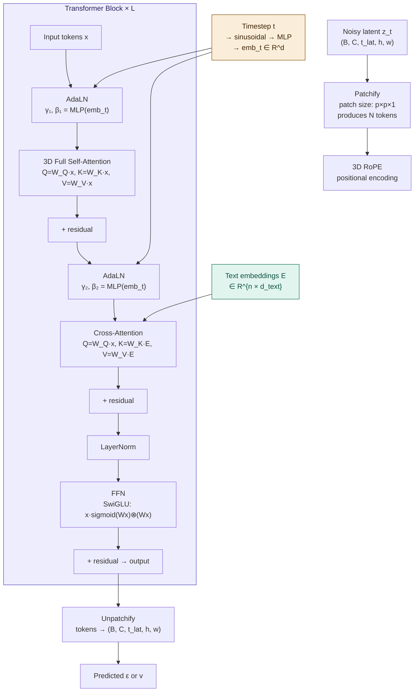

### 5.3 DiT patchification

The latent tensor $\mathbf{z} \in \mathbb{R}^{B \times C \times t \times h \times w}$ is split into non-overlapping patches of size $1 \times p \times p$:

$$N = t \times \frac{h}{p} \times \frac{w}{p} \quad \text{tokens per sequence}$$

Each patch is linearly projected to the model dimension:

$$\mathbf{x}_i = W_{\text{proj}} \cdot \text{flatten}(\mathbf{z}_{\text{patch}_i}) + \mathbf{b}, \quad W_{\text{proj}} \in \mathbb{R}^{d_{\text{model}} \times (C \cdot p^2)}$$

For CogVideoX-5B: $p=2$, $C=16$, giving $W_{\text{proj}} \in \mathbb{R}^{3072 \times 64}$.

---

## 6. Attention Mechanisms

### 6.1 Standard scaled dot-product attention

$$\text{Attention}(\mathbf{Q}, \mathbf{K}, \mathbf{V}) = \text{softmax}\left(\frac{\mathbf{Q}\mathbf{K}^\top}{\sqrt{d_k}}\right)\mathbf{V}$$

where:
- $\mathbf{Q} = \mathbf{X}\mathbf{W}_Q \in \mathbb{R}^{N \times d_k}$
- $\mathbf{K} = \mathbf{X}\mathbf{W}_K \in \mathbb{R}^{N \times d_k}$
- $\mathbf{V} = \mathbf{X}\mathbf{W}_V \in \mathbb{R}^{N \times d_v}$

The $\sqrt{d_k}$ scaling prevents vanishing gradients when $d_k$ is large.

### 6.2 Multi-head attention

$$\text{MHA}(\mathbf{X}) = \text{Concat}(\text{head}_1, \ldots, \text{head}_H)\mathbf{W}_O$$

$$\text{head}_i = \text{Attention}(\mathbf{X}\mathbf{W}_{Q_i},\; \mathbf{X}\mathbf{W}_{K_i},\; \mathbf{X}\mathbf{W}_{V_i})$$

where $d_k = d_v = d_{\text{model}} / H$.

### 6.3 Attention strategies comparison

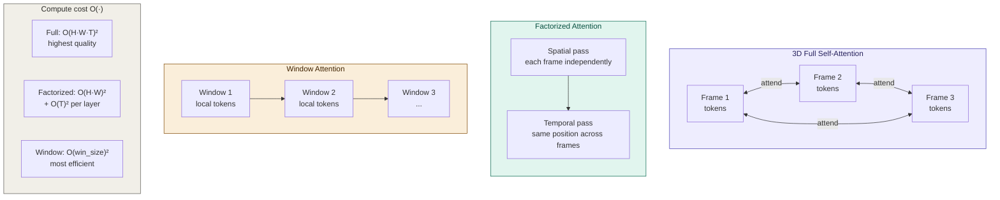

### 6.4 Flash Attention — memory optimization

Standard attention materializes the full $N \times N$ attention matrix in HBM (GPU high-bandwidth memory):

$$\text{Memory} = O(N^2) \quad \text{for } N \text{ tokens}$$

Flash Attention computes attention in tiles, keeping intermediate results in SRAM (on-chip cache):

$$\text{Memory} = O(N) \quad \text{(no full matrix in HBM)}$$

For a 49-frame 720×480 video with patch size 2:
$$N = 13 \times 360 \times 240 \approx 1{,}123{,}200 \text{ tokens}$$

Without Flash Attention: $N^2 \approx 1.26 \times 10^{12}$ — physically impossible. Flash Attention makes this tractable.

---

## 7. Positional Encoding (3D RoPE)

Standard transformers use additive positional embeddings. Video requires **3D Rotary Position Embeddings** to encode height, width, and time independently.

### 7.1 1D RoPE recap

For a token at position $m$, RoPE rotates the query/key vectors by angle $m\theta_i$ for each dimension pair $i$:

$$\mathbf{q}_m' = \mathbf{q}_m \cdot e^{im\theta_i}$$

The dot product between $\mathbf{q}_m$ and $\mathbf{k}_n$ then depends only on relative position $(m - n)$:

$$\langle \mathbf{q}_m', \mathbf{k}_n' \rangle = f(m - n)$$

This makes attention position-aware without adding parameters, and generalizes to unseen sequence lengths.

### 7.2 3D RoPE for video

Each token has three coordinates $(h, w, t)$. The embedding dimension $d$ is split into three portions:

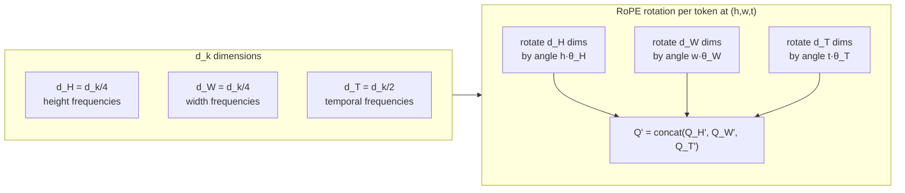

**Frequency base:**

$$\theta_i = b^{-2i/d}, \quad b = 10000 \text{ (standard)}$$

Spatial dimensions use higher base frequencies (finer position sensitivity). Temporal dimensions use lower base frequencies (coarser, generalize to more frames).

### 7.3 Why this enables length generalization

Training on 49 frames, inference on 97 frames. RoPE extrapolates because:

$$\text{Attn}(\mathbf{q}_m', \mathbf{k}_n') = \text{Attn}(m - n) \quad \leftarrow \text{only depends on relative offset}$$

Position 60 at inference is just "60 steps ahead" — not an out-of-distribution absolute token ID.

---

## 8. Conditioning Mechanisms

### 8.1 Classifier-Free Guidance (CFG)

During training, the text condition $\mathbf{c}$ is randomly replaced with a null embedding $\emptyset$ with probability $p_{\text{uncond}}$ (typically 0.1–0.2):

$$\boldsymbol{\varepsilon}_\theta(\mathbf{z}_t, t, \mathbf{c}) \approx \text{conditional prediction}$$
$$\boldsymbol{\varepsilon}_\theta(\mathbf{z}_t, t, \emptyset) \approx \text{unconditional prediction}$$

At inference, the final prediction is an extrapolation:

$$\hat{\boldsymbol{\varepsilon}} = \boldsymbol{\varepsilon}_\theta(\mathbf{z}_t, t, \emptyset) + w \cdot \left[\boldsymbol{\varepsilon}_\theta(\mathbf{z}_t, t, \mathbf{c}) - \boldsymbol{\varepsilon}_\theta(\mathbf{z}_t, t, \emptyset)\right]$$

where $w$ is the **guidance scale** (typically 6–7.5 for video).

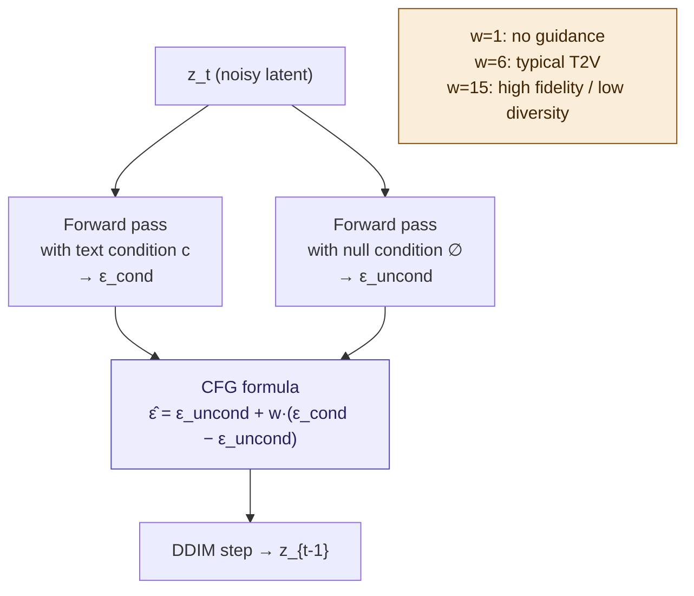

**Effect of guidance scale $w$:**

| $w$ | Effect |
|---|---|
| 1.0 | Unconditional — ignores prompt |
| 3.0 | Weak conditioning |
| 6.0 | Standard for video (balance quality/diversity) |
| 10.0 | Strong prompt adherence, less diversity |
| 15.0+ | Oversaturation, artifacts |

### 8.2 Adaptive Layer Normalization (AdaLN)

Standard LayerNorm applies fixed $\gamma, \beta$ parameters. AdaLN predicts them from the timestep embedding:

$$\text{LayerNorm}(\mathbf{x}) = \frac{\mathbf{x} - \mu}{\sigma} \cdot \boldsymbol{\gamma} + \boldsymbol{\beta}$$

In AdaLN:

$$\boldsymbol{\gamma}_t, \boldsymbol{\beta}_t = \text{MLP}(\text{emb}(t))$$

$$\text{AdaLN}(\mathbf{x}, t) = \boldsymbol{\gamma}_t \cdot \frac{\mathbf{x} - \mu}{\sigma} + \boldsymbol{\beta}_t$$

This allows the model's normalization behavior to vary continuously with the noise level — at high $t$ (lots of noise), the model behaves differently than at low $t$ (nearly clean).

### 8.3 Timestep embedding

$$t \xrightarrow{\text{sinusoidal}} \mathbf{e}_t^{\sin} \xrightarrow{\text{MLP}} \mathbf{e}_t \in \mathbb{R}^{d_{\text{model}}}$$

$$e_t^{\sin}[2i] = \sin(t / 10000^{2i/d}), \quad e_t^{\sin}[2i+1] = \cos(t / 10000^{2i/d})$$

---

## 9. Noise Schedules

### 9.1 DDPM cosine schedule

$$\bar{\alpha}_t = \frac{f(t)}{f(0)}, \quad f(t) = \cos^2\left(\frac{t/T + s}{1 + s} \cdot \frac{\pi}{2}\right)$$

where $s = 0.008$ is an offset preventing $\beta_t$ from being too small near $t=0$.

### 9.2 Rectified flow / flow matching (modern standard)

Instead of curved diffusion trajectories, flow matching uses **straight-line interpolation**:

$$\mathbf{z}_t = (1 - t)\mathbf{z}_0 + t\boldsymbol{\varepsilon}, \quad t \in [0, 1]$$

The velocity field to learn is simply:

$$\mathbf{v}_t = \boldsymbol{\varepsilon} - \mathbf{z}_0$$

The training loss is:

$$\mathcal{L}_{\text{flow}} = \mathbb{E}_{t, \mathbf{z}_0, \boldsymbol{\varepsilon}}\left[\left\|(\boldsymbol{\varepsilon} - \mathbf{z}_0) - \mathbf{v}_\theta(\mathbf{z}_t, t, \mathbf{c})\right\|^2\right]$$

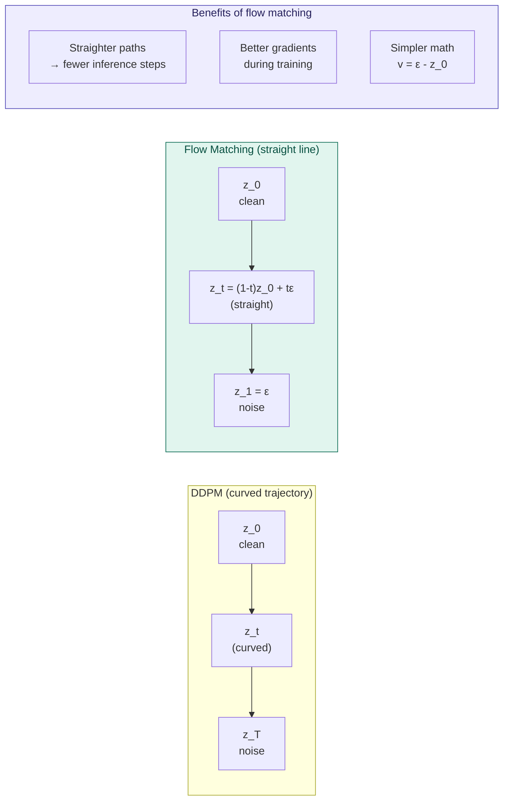

**Why flow matching is better:** Shorter, straighter paths mean the ODE solver needs fewer function evaluations (steps) to trace from noise to clean video. This is why LTX-Video distilled can generate in 4–8 steps while DDPM-based models need 50+.

---

## 10. Training Pipeline

### 10.1 Multi-stage training

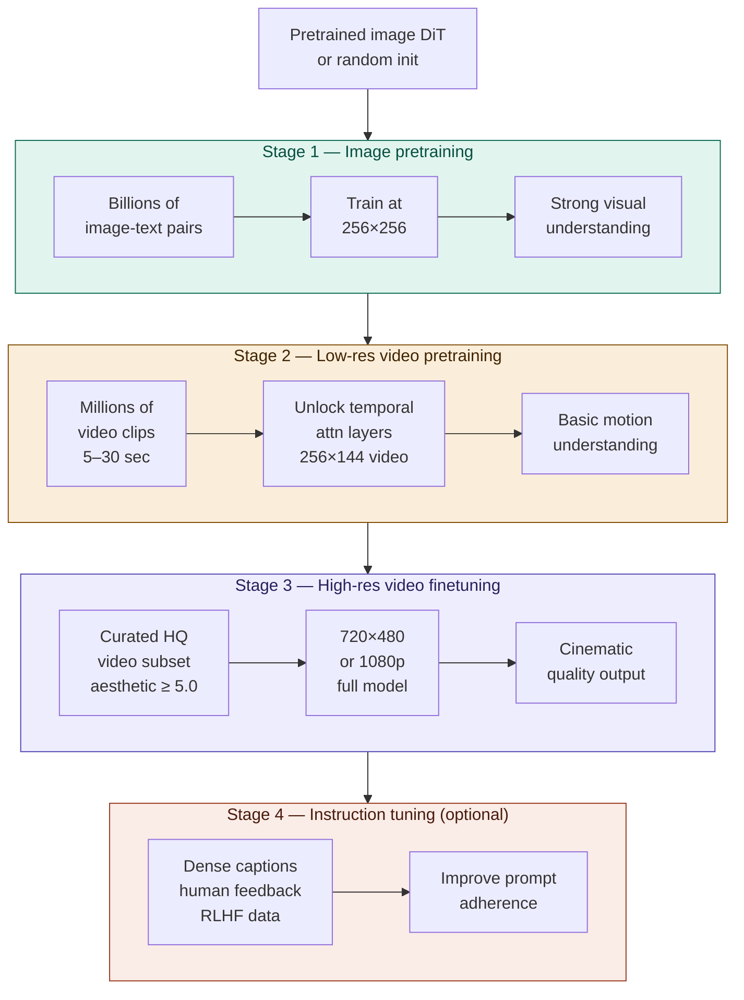

### 10.2 Joint image-video training

A key modern insight: images are single-frame videos. Training simultaneously on images and videos:

- Prevents catastrophic forgetting of visual quality during video training
- Image datasets are ~100× larger than video datasets — free quality boost
- Images are treated as $T=1$ videos with temporal attention masked

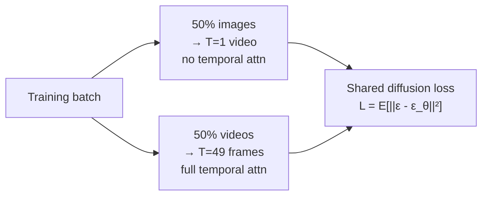

### 10.3 Data curation pipeline

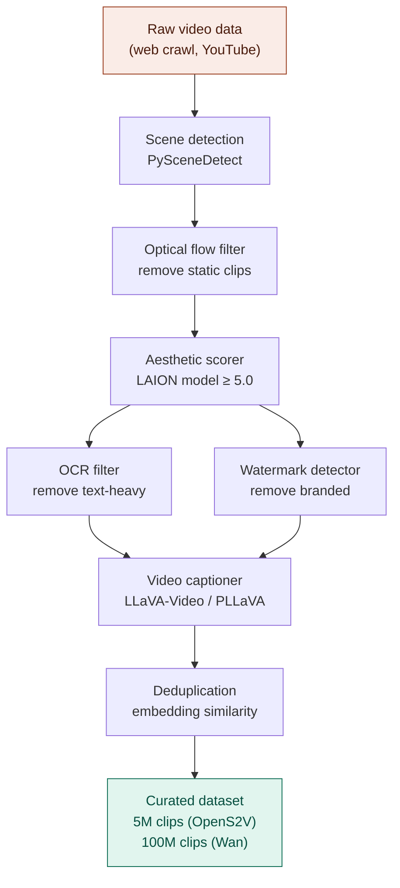

---

## 11. Inference Techniques

### 11.1 DDIM sampling

DDIM enables deterministic sampling in far fewer steps by finding a non-Markovian process with the same marginals:

$$\mathbf{z}_{t-1} = \sqrt{\bar{\alpha}_{t-1}} \underbrace{\left(\frac{\mathbf{z}_t - \sqrt{1-\bar{\alpha}_t}\,\hat{\boldsymbol{\varepsilon}}}{\sqrt{\bar{\alpha}_t}}\right)}_{\hat{\mathbf{z}}_0} + \underbrace{\sqrt{1 - \bar{\alpha}_{t-1} - \sigma_t^2}\,\hat{\boldsymbol{\varepsilon}}}_{\text{direction to } \mathbf{z}_t} + \sigma_t \boldsymbol{\xi}$$

When $\sigma_t = 0$: fully deterministic (same seed → same video).
When $\sigma_t = \sqrt{(1-\bar{\alpha}_{t-1})/(1-\bar{\alpha}_t)}\sqrt{1 - \bar{\alpha}_t/\bar{\alpha}_{t-1}}$: recovers DDPM.

### 11.2 DPM-Solver++ (fastest sampler)

Treats the reverse ODE as a system and uses high-order integration. Achieves quality comparable to 1000-step DDPM in just **20 steps**.

The key insight: the ODE solution can be expressed as:

$$\mathbf{z}_t = e^{-\lambda_t}\mathbf{z}_s + \int_{\lambda_s}^{\lambda_t} e^{-(\lambda_t - r)} \hat{\boldsymbol{\varepsilon}}_\theta(\mathbf{z}_r, r)\,dr$$

where $\lambda_t = \log(\bar{\alpha}_t / \sqrt{1 - \bar{\alpha}_t})$.

Approximating this integral with Taylor expansion gives DPM-Solver++'s multi-step algorithm.

### 11.3 Consistency distillation

Train a student model $f_\theta$ to directly predict the clean video from any noise level:

$$f_\theta(\mathbf{z}_t, t) = \mathbf{z}_0 \quad \forall t$$

The consistency loss penalizes differences between adjacent timesteps:

$$\mathcal{L}_{\text{consist}} = \mathbb{E}\left[d\left(f_\theta(\mathbf{z}_t, t),\; f_{\theta^-}(\hat{\mathbf{z}}_{t-\Delta}, t-\Delta)\right)\right]$$

where $d$ is a distance metric and $\theta^-$ is an EMA of parameters. This enables 1–4 step generation.

### 11.4 Full inference flow

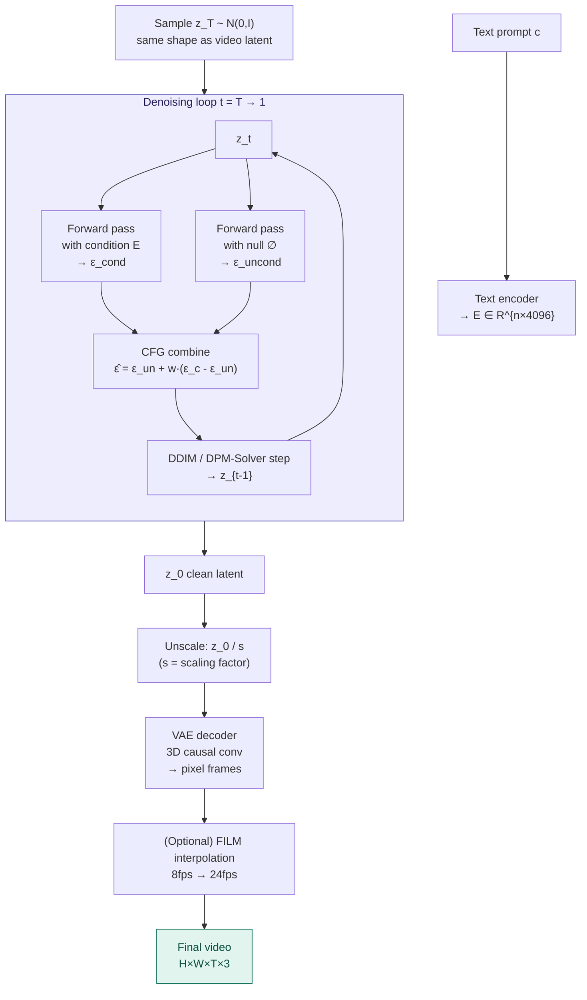

---

## 12. Model Comparisons

### 12.1 Architecture at a glance

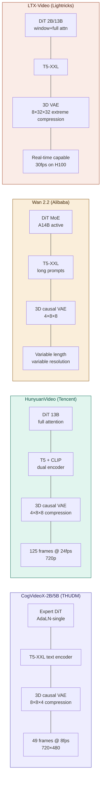

### 12.2 Scaling laws

Models approximately follow power-law scaling:

$$\text{Quality} \propto N^{\,0.07} \cdot D^{\,0.26} \cdot C^{\,0.32}$$

where $N$ = parameters, $D$ = training data tokens, $C$ = compute (FLOPs). Data and compute are more impactful than raw parameter count.

### 12.3 Memory requirements

| Model | Params | FP16 weights | INT8 weights | Min VRAM (offload) |
|---|---|---|---|---|
| CogVideoX-2B | 2B | 4 GB | 2 GB | ~4 GB |
| CogVideoX-5B | 5B | 10 GB | 5 GB | ~7 GB |
| LTX-Video 2B | 2B | 4 GB | 2 GB | ~6 GB |
| HunyuanVideo | 13B | 26 GB | 13 GB | ~14 GB |
| Wan 2.1-14B | 14B | 28 GB | 14 GB | ~16 GB |

---

## 13. Minor but Critical Details

### 13.1 Mixture of Experts (MoE) — Wan 2.2

Standard dense FFN: every parameter is active for every token.

MoE FFN: each token is routed to $k$ of $N$ expert networks:

$$\text{MoE}(\mathbf{x}) = \sum_{i \in \text{Top-k}(g(\mathbf{x}))} g_i(\mathbf{x}) \cdot \text{FFN}_i(\mathbf{x})$$

where $g(\mathbf{x}) = \text{softmax}(\mathbf{x} \cdot \mathbf{W}_g)$ are the gating weights.

**Result:** A 14B parameter model with the compute cost of a 3B dense model. Quality scales with total parameters; inference cost scales with active parameters.

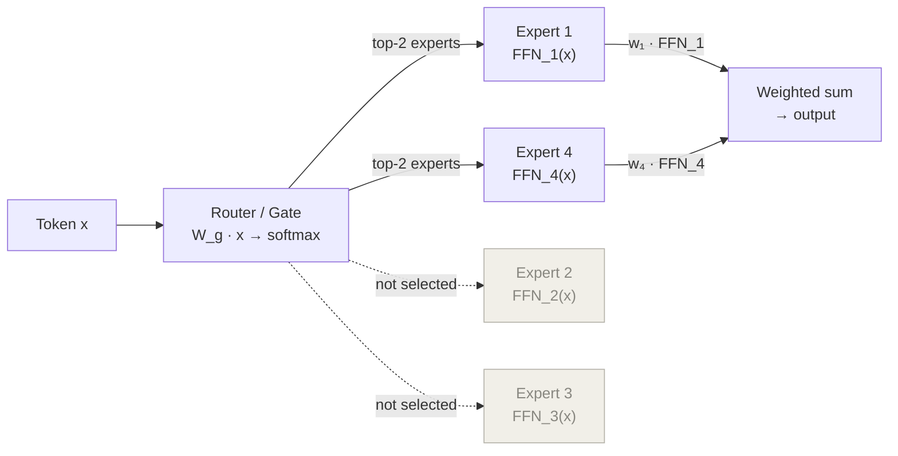

### 13.2 SwiGLU activation

Modern DiTs use SwiGLU instead of ReLU/GELU in FFN blocks:

$$\text{SwiGLU}(\mathbf{x}) = \text{Swish}(\mathbf{W}_1 \mathbf{x}) \odot \mathbf{W}_2 \mathbf{x}$$

$$\text{Swish}(x) = x \cdot \sigma(x) = \frac{x}{1 + e^{-x}}$$

This outperforms standard GELU empirically by ~0.5 perplexity points on language modeling, and the benefit transfers to vision tasks.

### 13.3 QK-Norm

Training instability in large video models comes partly from attention logit explosion. QK-Norm normalizes queries and keys before computing attention:

$$\text{Attention} = \text{softmax}\left(\frac{\text{norm}(\mathbf{Q})\,\text{norm}(\mathbf{K})^\top}{\sqrt{d_k}}\right)\mathbf{V}$$

This prevents $\mathbf{Q}\mathbf{K}^\top$ from growing unboundedly with depth, enabling training of 13B+ models.

### 13.4 Noise augmentation for I2V

In image-to-video models, the conditioning frame is concatenated to the noisy video latent. Without augmentation, the model learns to copy-paste the first frame. The fix:

$$\mathbf{z}_{\text{cond, aug}} = \sqrt{\bar{\alpha}_{t'}} \mathbf{z}_{\text{cond}} + \sqrt{1 - \bar{\alpha}_{t'}} \boldsymbol{\varepsilon}', \quad t' \sim \mathcal{U}[0, T_{\text{aug}}]$$

Adding noise to the conditioning frame forces the model to learn genuine temporal dynamics rather than identity copying.

### 13.5 Motion score filtering

Videos are filtered during training by optical flow magnitude to ensure sufficient motion:

$$\text{motion\_score} = \frac{1}{T-1} \sum_{t=1}^{T-1} \|\mathbf{F}_{t \to t+1}\|_2$$

where $\mathbf{F}_{t \to t+1}$ is the optical flow field. Videos below a threshold (typically ~2 px/frame) are discarded as too static; above ~50 px/frame are discarded as too chaotic.

---

## 14. Complexity Analysis

### 14.1 Attention complexity breakdown

| Operation | Time complexity | Space complexity |
|---|---|---|
| Self-attention (full) | $O(N^2 \cdot d)$ | $O(N^2)$ |
| Self-attention (Flash) | $O(N^2 \cdot d)$ | $O(N)$ |
| Cross-attention | $O(N \cdot L \cdot d)$ | $O(N \cdot L)$ |
| FFN (dense) | $O(N \cdot d^2)$ | $O(d^2)$ |
| FFN (MoE, k/N active) | $O(N \cdot d^2 \cdot k/N_{\text{exp}})$ | $O(d^2 \cdot N_{\text{exp}})$ |

where $N$ = video tokens, $L$ = text tokens, $d$ = model dim, $N_{\text{exp}}$ = number of experts.

### 14.2 FLOPs estimation for one forward pass

For CogVideoX-5B generating a 49-frame 720×480 video:

$$N_{\text{tokens}} = 13 \times \frac{60}{2} \times \frac{90}{2} = 13 \times 30 \times 45 = 17{,}550$$

Per transformer layer FLOPs:

$$\text{FLOPs}_{\text{attn}} \approx 4 \cdot N^2 \cdot d = 4 \times 17550^2 \times 3072 \approx 3.8 \times 10^{12}$$

$$\text{FLOPs}_{\text{FFN}} \approx 8 \cdot N \cdot d^2 = 8 \times 17550 \times 3072^2 \approx 1.3 \times 10^{12}$$

For 42 layers × 50 inference steps:

$$\text{Total} \approx 42 \times 50 \times (3.8 + 1.3) \times 10^{12} \approx 1.07 \times 10^{16} \text{ FLOPs}$$

This is why video generation takes ~15 minutes on a T4 — a T4 delivers ~65 TFLOPS FP16, so theoretical minimum is ~165 seconds. Real inference adds memory bandwidth overhead.

---

## Glossary

| Term | Definition |
|---|---|
| DiT | Diffusion Transformer — transformer-based denoising network |
| VAE | Variational Autoencoder — compresses video to/from latent space |
| RoPE | Rotary Position Embeddings — relative positional encoding |
| CFG | Classifier-Free Guidance — amplifies text conditioning at inference |
| AdaLN | Adaptive Layer Normalization — timestep-conditioned normalization |
| MoE | Mixture of Experts — sparse FFN routing for efficient scaling |
| DDIM | Denoising Diffusion Implicit Models — fast deterministic sampler |
| Flow matching | Straight-line interpolation noise schedule — faster convergence |
| Flash Attention | IO-aware attention — reduces memory from O(N²) to O(N) |
| SwiGLU | Swish-Gated Linear Unit — activation function in FFN blocks |
| QK-Norm | Query-Key Normalization — prevents attention logit explosion |
| Causal conv | Convolution that only looks at past frames — no future leakage |

---

*Generated reference: Text-to-Video Architecture. Models covered: CogVideoX, HunyuanVideo, Wan 2.x, LTX-Video, Open-Sora, AnimateDiff.*
